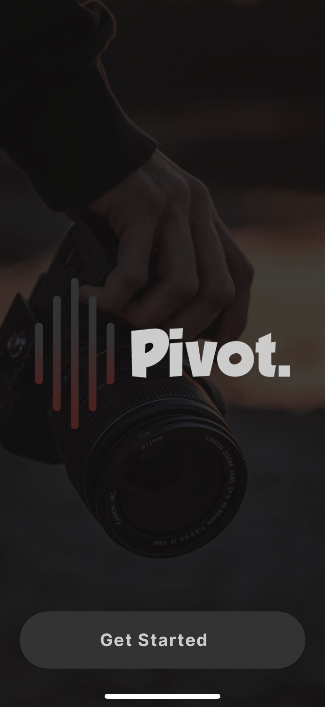
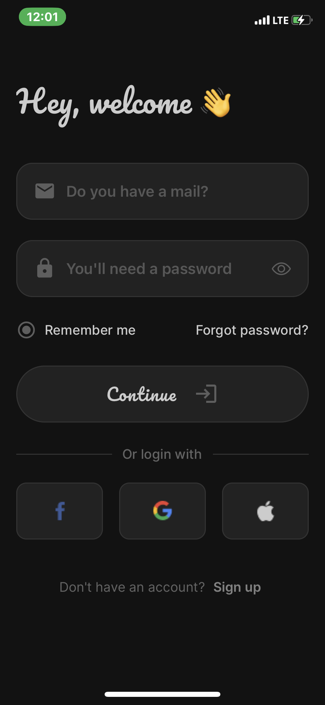
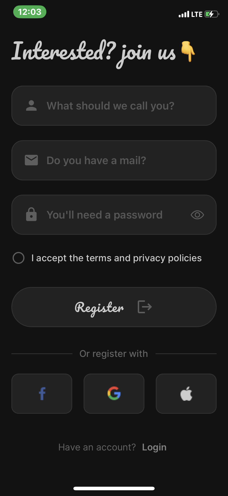

# Project Name

Pivot (Login / Register Screen)

## Overview

This project is a mobile application built with React Native that serves as a tutorial app. It includes features such as a getStarted screen, three onboarding screens, login, and register screens. I also used various react libraries

## Screenshots

## Features

- **Get Started Screen:** The initial screen displayed to users when they open the app for the first time. Provides an introduction to the app and its features.

- **Onboarding Screens:** Three onboarding screens that guide users through the app's key features and functionalities. I used async Storage to handle the process when the onBoarding is complete.

- **Login Screen:** Allows users to log in to their accounts using their credentials.

- **Register Screen:** Allows new users to create an account by providing their details.

## Usage

Once the app is running, you can navigate through the various screens using the provided navigation controls (e.g., buttons, tabs). Explore the app's features and functionalities as described in the onboarding screens.

## UI Components

Navigation: React Navigation
Buttons: TouchableOpacity
Text Inputs: TextInput
Icons: React Native Vector Icons
Components: I also used components effectively
etc.
